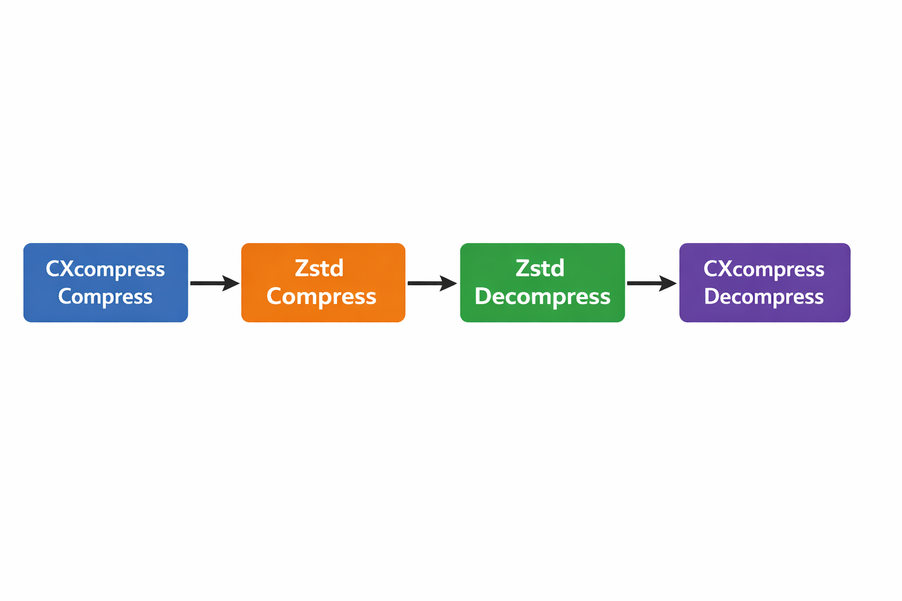

# CXcompress v1.1.0
CXcompress is a lossless text/binary-code compressor with the vision of being the best open-source preprocessing compressor on the internet



This compression library is built to be used before the very popular zstd created by Yann Collet at Meta. CXcompress can also be used as a preprocessing step for other compressors like cmix, zlib, or lzma for improved performance

## Tested on 10.2MB Charles Dickens dataset (a.k.a. dickens)
| Compression Method             | Compressed Size (bytes) | Compress Time (s) | Decompress Time (s) |
|-------------------------------|----------------:|---------------:|---------------:|
| Zstd (level 19 with dictionary trained on enwik9)               |        3,212,810 |          2.723 |          0.041 |
| CXcompress (trained on enwik9) + Zstd (level 19 with dictionary trained on CXcompress dictionary symbols)  |        2,969,829 |          1.790 |          0.085 |

## Tested on 50KB dickens dataset sample
| Compression Method             | Compressed Size (bytes) | Compress Time (s) | Decompress Time (s) |
|-------------------------------|----------------:|---------------:|---------------:|
| Zstd (level 1 with dictionary trained on enwik9)               |        21,825 |          0.131 |          0.014 |
| CXcompress (trained on enwik9) + Zstd (level 1 with dictionary trained on CXcompress dictionary symbols)  |        17,457 |          0.113 |          0.038 |

# Algorithm
This is a dictionary compression algorithm; words are replaced with combinations of letters. Differing from other algorithms, the order of the letter symbols in the dictionary are determined by their frequency in text. A pre-determined order is used to save processing time.

This dictionary structure increases the Zipfian characteristics of the transformed data, making it easier to compress

# Usage (supports MacOS/Linux)
### Compilation
```
gcc-14 -Wall -O3 -fopenmp CXcompress.c -o CXcompress
```

### Compression
```
./CXcompress -c <input_file> <dictionary_file> <language_pack_int> <num_threads>
```
You can use the "dict" file as a prebuilt English dictionary and the prebuilt "0" English language pack

### Decompression
```
./CXcompress -d <compressed_file> <dictionary_file> <language_pack_int> <num_threads>
```

## Notes
The runtime of the compressor will be slower only the first time you run it; after that it will be fast for all files due to caching/initilization

The compressor will exit without compressing under rare scenarios. To use this in production, compress with other algorithm alone if this happens

While using zstd after CXcompress, train a zstd dictionary on 100 copies of the language pack file you are using and call zstd with this dictionary

If you want even faster performance at the cost of compression ratio, instead of 100 copies of the language pack, train the zstd dict on copies of the language pack with the symbols closer to the top of the language pack appearing more often

Dictionaries for CXcompress can be trained by creating a "\n" separated file of common words

## TODO
1. 📚 More prebuilt dictionaries and language packs
2. 🚀 Add CUDA support for massively parallel operation with GPUs
3. 🔨 Algorithmic development

## License TL;DR
This software is free for non-commercial use. For commercial use, we are offering a free 6 month trial to early customers then a licensing fee of 12% of cost savings
