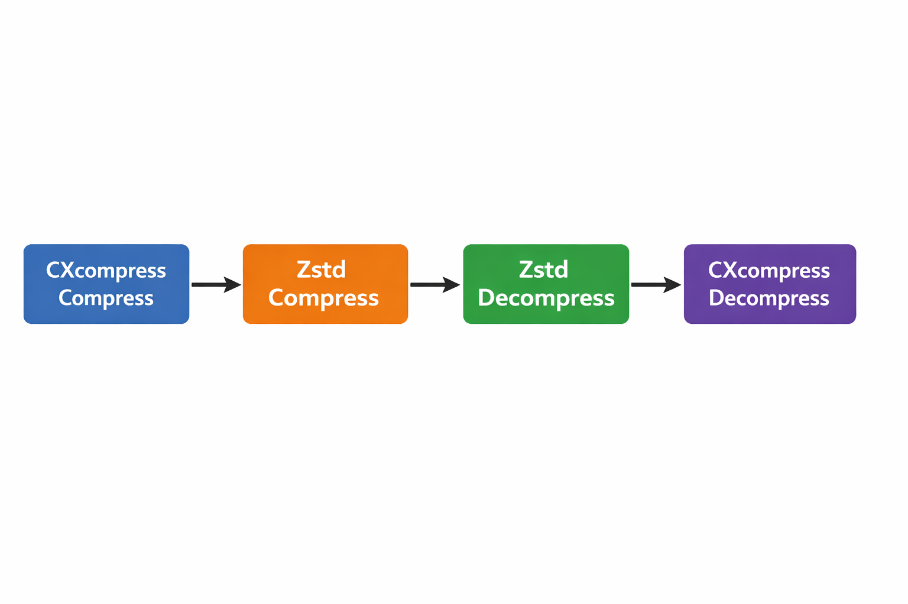

# CXcompress v1.1.0
## Tested on 10.2MB Charles Dickens dataset (a.k.a. dickens)
| Compression Method             | Compressed Size (bytes) | Compress Time (s) | Decompress Time (s) |
|-------------------------------|----------------:|---------------:|---------------:|
| Zstd (level 10 with dictionary trained on enwik8)               |        3,212,810 |          0.477 |          0.036 |
| CXcompress (trained on enwik8) + Zstd (level 10)  |        2,901,301 |          0.376 |          0.08 |


CXcompress is a lossless text/binary-code compressor with the vision of being the best open-source preprocessing compressor on the internet



This compression library is built to be used before the very popular zstd created by Yann Collet at Meta. CXcompress can also be used as a preprocessing step for other compressors like cmix, zlib, or lzma for improved performance

# Algorithm
This is a dictionary compression algorithm; words are replaced with combinations of letters. Differing from other algorithms, the order of the letter symbols in the dictionary are determined by their frequency in text. A pre-determined order is used to save processing time.

This dictionary structure increases the Zipfian characteristics of the transformed data, making it easier to compress

# Usage
### Compilation
```
gcc-14 -Wall -O3 -fopenmp CXcompress.c -o CXcompress
```

### Compression
```
./CXcompress -c <input_file> <dictionary_file> <language_pack_int> <num_threads> <output_file>
```
You can use the "dict" file as a prebuilt English dictionary and the prebuilt "0" English language pack

### Decompression
```
./CXcompress -d <compressed_file> <dictionary_file> <language_pack_int> <num_threads> <output_file>
```

## Notes
The runtime of the compressor will be slower only the first time you run it; after that it will be fast for all files due to caching/initialization

The compressor will exit without compressing if you run out of memory

If you want to learn tricks on how to use CXcompress to achieve either better compression or faster speed, contact clymersam@gmail.com

Dictionaries for CXcompress can be trained by creating a "\n" separated file of common words

## TODO
1. 📚 More prebuilt dictionaries and language packs
2. 🚀 Add CUDA support for massively parallel operation with GPUs
3. 🔨 Algorithmic development

## License TL;DR
This software is free with optional paid upgrades
